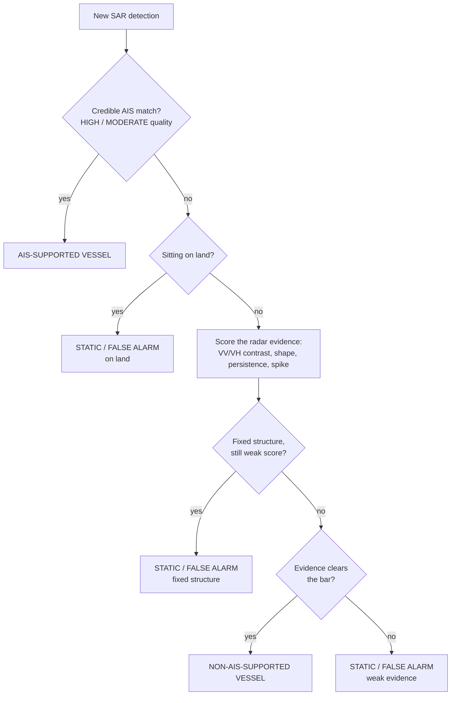

# SAR Ship Detection — 3-Class Classification

Ship detection over the Singapore Strait from Sentinel-1 SAR imagery, classified into
three categories: AIS-supported vessels, non-AIS-supported vessels, and static /
probable false alarms. Static objects are identified from their VV/VH backscatter
behaviour over time, not from a single image.

## Pipeline

```
01_model_training  →  02_detection_pipeline  →  03_final_classification
   train YOLO            detect + AIS-match       VV/VH time series →
                          every object             final 3-class label
```

**01 — model training** (`Ship_Detection_3_0_Modified_Visual_Realtime.ipynb`, Colab).
Prepares the SSDD dataset and trains two YOLO11s detectors: E0 (baseline) and E1
(sensor-mix augmented). Weights land in `models/`.

**02 — detection pipeline** (`SAR_Ship_Detection_FINAL_Kaggle_V4_1.ipynb`, Kaggle).
Runs both detectors over 18 Sentinel-1 scenes, checks each object against a shoreline
layer, measures its SAR signature (length, width, contrast), and matches it against
Global Fishing Watch AIS data. Output is an object-level table with a first-pass
5-class label.

**03 — final classification** (`SAR_Ship_Detection_FINAL_3Class_VV_VH_TimeSeries.ipynb`,
Kaggle or local). Takes that table plus the VV/VH rasters and samples backscatter at
every detection's location across *every* scene date, not just the ones it was
detected on. That time series, plus an AIS-anchored vessel-evidence model, produces the
final three classes. `scripts/run_vv_vh_3class_local.py` runs the same logic on a
laptop, no Kaggle or raw satellite data required — it works off the stage-2 table and a
local cache of VV/VH arrays.

## How the classification decision works

AIS wins outright if it's credible. Everything else is decided by the radar signal —
absence of AIS never rejects an object on its own.



A fixed structure is anything bright on 82%+ of the dates it's checked, with position
drift under 20m and stable VV/VH contrast over time, seen on 4+ separate dates — a real
ship, even one that's anchored and keeps coming back, won't be bright every single
time. Vessel evidence clears the bar at a score of 0.40, calibrated against known AIS
vessels for 95% recall, or on a fresh brightness spike over a location's own history.
About 5% of objects land close enough to these boundaries to get flagged for manual
review; the flag doesn't change their class.

## Results

Development scenes, 11,914 objects, run 2026-08-31:

| Class | Count | % |
|---|---|---|
| Non-AIS-supported vessel | 5,923 | 49.7% |
| AIS-supported vessel | 3,481 | 29.2% |
| Static / probable false alarm | 2,510 | 21.1% |

Cross-validated against known AIS vessels: 95.0% recall, 94.0% balanced accuracy.

`results/FINAL_3CLASS_OBJECTS.csv` is the deliverable — all 11,914 objects, one row
each, with `final_class_3`, the evidence behind it (position, geometry, VV/VH contrast,
temporal persistence and spike, `vessel_score`), a plain-language
`classification_reason`, and the QA `review_flag`.


## Running it

Stage 1: open in Colab, mount Drive, run top to bottom.

Stage 2: Kaggle only — attach `models/*.pt` and the Sentinel-1 scene inputs as Kaggle
datasets, run top to bottom.

Stage 3: run the notebook on Kaggle with stage 2's output table and the VV/VH rasters
attached, or run `scripts/run_vv_vh_3class_local.py` locally (needs pandas,
scikit-learn, matplotlib, scipy, rasterio, pyproj), pointed at stage 2's CSV and a VV/VH
scene array folder via the `SAR_PROJECT_ROOT` environment variable.
