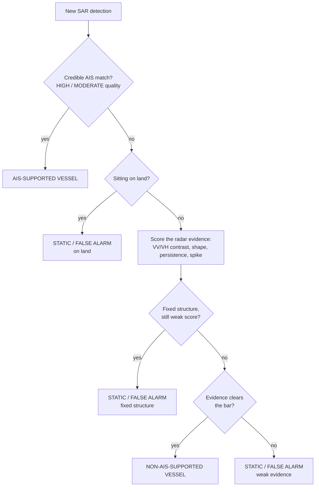
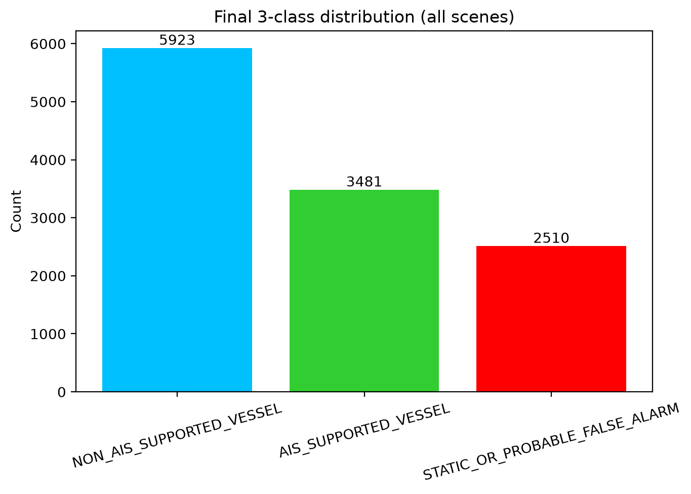
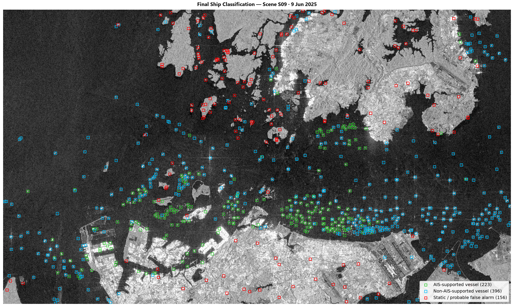
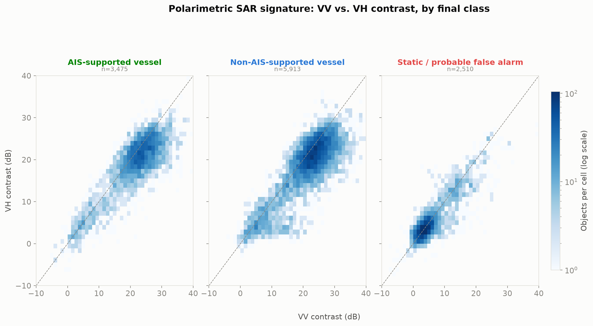
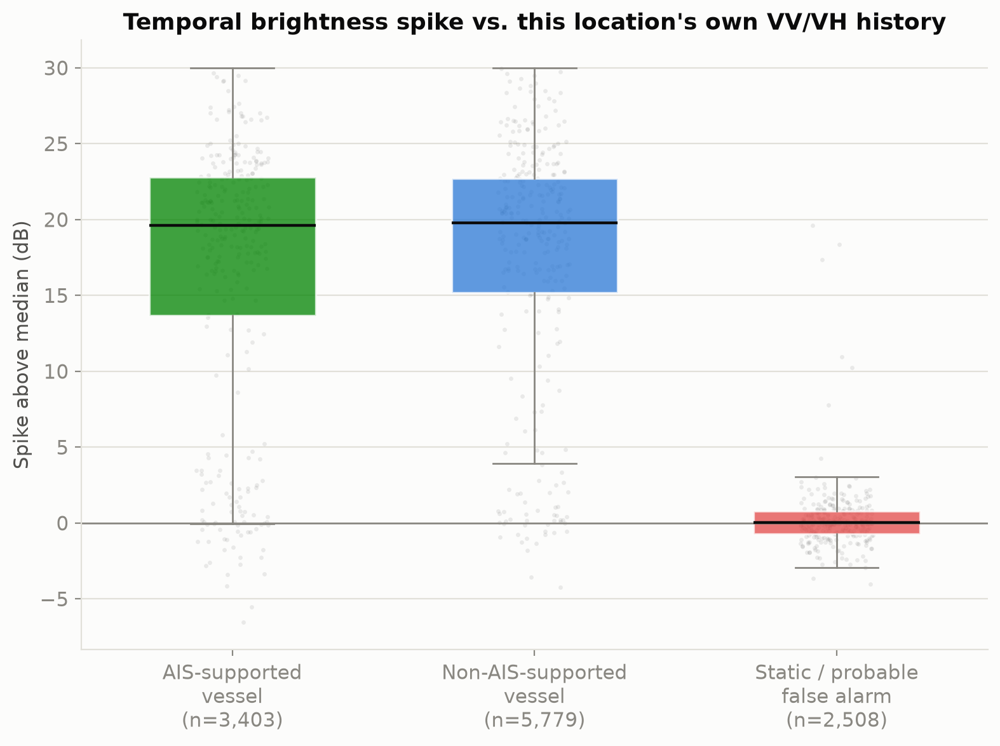

# SAR Ship Detection — 3-Class Classification

Detects ships in Sentinel-1 SAR imagery over the Singapore Strait and classifies every
detection into three categories:

1. **AIS-supported vessel** — a credible AIS match.
2. **Non-AIS-supported vessel** — no AIS match, but the Sentinel-1 VV/VH radar signature
   looks like a ship.
3. **Static / probable false alarm** — on land, a fixed scatterer confirmed by its VV/VH
   backscatter *time series*, or evidence too weak to call it a vessel.

**Brief this satisfies:** *"Classify into AIS-supported vessels, non-AIS-supported vessels,
and static/probable false alarms. Use Sentinel-1 VV/VH time series to identify static
objects."*

---

## Contents

- [Pipeline](#pipeline)
- [Classification logic](#classification-logic)
- [Results](#results)
- [Repository structure](#repository-structure)
- [What's excluded, and why](#whats-excluded-and-why)
- [Running it](#running-it)

---

## Pipeline

Three stages, run in order — each one's output feeds the next.

```
01_model_training  →  02_detection_pipeline  →  03_final_classification
   (train YOLO)         (find + AIS-match          (VV/VH time series →
                          every object)              final 3-class label)
```

**`01_model_training/`** — *Google Colab.*
`Ship_Detection_3_0_Modified_Visual_Realtime.ipynb` prepares the SSDD benchmark dataset
(COCO → YOLO format) and trains two frozen YOLO11s detectors:
- **E0** — baseline
- **E1** — sensor-mix augmented

Output: `E0_YOLO11s_SSDD_Baseline.pt`, `E1_YOLO11s_SSDD_SensorMix.pt` (in `models/`).

**`02_detection_pipeline/`** — *Kaggle.*
`SAR_Ship_Detection_FINAL_Kaggle_V4_1.ipynb` runs both detectors (tiled inference) over
18 controlled Sentinel-1 scenes, checks every object against a shoreline layer (GSHHG),
extracts SAR signature properties (length, width, aspect ratio, VV/VH contrast), matches
objects to Global Fishing Watch AIS data, and produces one object-level table with an
initial 5-class label. This 5-class table is the input the next stage re-classifies.

**`03_final_classification/`** — *Kaggle, or locally.*
`SAR_Ship_Detection_FINAL_3Class_VV_VH_TimeSeries.ipynb` takes stage 2's table plus
co-registered VV/VH rasters, samples radar backscatter at every detection's location
across **every** scene date (not just the dates something was detected there), and
re-derives the three final classes from that time series plus an AIS-anchored
vessel-evidence model (calibrated to 95% recall on known AIS vessels). This is what
produced the results below.

`scripts/run_vv_vh_3class_local.py` reproduces the same logic on a laptop — no Kaggle,
no raw SAFE data, no AIS API token — reading the stage-2 table and a local cache of
VV/VH scene arrays instead. `scripts/make_property_figures.py` draws the evidence
figures; `scripts/retitle_classification_maps.py` cleans up map titles for reporting.

---

## Classification logic

Every detection runs down this chain until one box catches it. AIS is checked first and
wins immediately if credible; everything after that is decided purely by the radar
signal — AIS *absence* alone never rejects an object.



| # | Check | Exact rule |
|---|---|---|
| 1 | **Credible AIS match** | An AIS broadcast lines up with the detection in space and time, **and** match quality is `HIGH` or `MODERATE`. A `LOW`-quality match doesn't count — it's judged on radar evidence instead, like any other object. |
| 2 | **On land** | Detection center sits over mapped land → automatic reject. Checked before anything else is measured. |
| 3 | **Fixed structure, not a vessel** | All of: bright on `≥82%` of scene dates checked, position drifts `≤20m` across repeats, VV/VH contrast is stable over time (`relative MAD ≤0.30`), seen on `≥4` separate dates. A real ship — even one anchored and recurring — won't be bright *every single time*, so pure recurrence alone never triggers this. |
| 4 | **Radar evidence clears the bar** | Vessel-evidence score `≥0.40` (calibrated for 95% AIS recall) **or** a rescue rule: ship-plausible geometry, currently brighter than background, and either not persistently bright (`≤60%` of dates) or a fresh spike `≥1dB` above its own history. Fails both → final fallback: static / probable false alarm. |

A `review_flag` (not a fourth class) is separately raised on objects that land close to
these boundaries (~5% of objects), for manual QA — their forced 3-class label stands
either way.

---

## Results

Development scenes, 11,914 objects, run 2026-08-31:

| Class | Count | % |
|---|---|---|
| Non-AIS-supported vessel | 5,923 | 49.7% |
| AIS-supported vessel | 3,481 | 29.2% |
| Static / probable false alarm | 2,510 | 21.1% |

Model quality (cross-validated against known AIS vessels): **95.0% recall**, 94.0%
balanced accuracy, calibrated vessel-score threshold **0.40**.

**[`results/FINAL_3CLASS_OBJECTS.csv`](results/FINAL_3CLASS_OBJECTS.csv)** is the actual
deliverable: all 11,914 objects, one row each, with `final_class_3` plus every piece of
evidence behind it — position, geometry, VV/VH contrast, temporal persistence/spike,
`vessel_score`, a plain-language `classification_reason`, and the QA `review_flag`.

<table>
<tr>
<td><br><sub>Final 3-class distribution</sub></td>
<td><br><sub>Sample scene classification map</sub></td>
</tr>
<tr>
<td><br><sub>VV vs. VH contrast separates vessels from false alarms</sub></td>
<td><br><sub>Vessels show a real brightness spike; static objects don't — this is the VV/VH time-series evidence</sub></td>
</tr>
</table>

---

## Repository structure

```
SAR-Ship-Detection/
├── README.md                          - this file
├── 01_model_training/
│   └── Ship_Detection_3_0_Modified_Visual_Realtime.ipynb
├── 02_detection_pipeline/
│   └── SAR_Ship_Detection_FINAL_Kaggle_V4_1.ipynb
├── 03_final_classification/
│   ├── SAR_Ship_Detection_FINAL_3Class_VV_VH_TimeSeries.ipynb
│   └── scripts/
│       ├── run_vv_vh_3class_local.py
│       ├── make_property_figures.py
│       └── retitle_classification_maps.py
├── models/
│   ├── E0_YOLO11s_SSDD_Baseline.pt
│   └── E1_YOLO11s_SSDD_SensorMix.pt
└── results/
    ├── FINAL_3CLASS_OBJECTS.csv       - the deliverable: every object, final class + evidence
    ├── class_distribution.png
    ├── vv_vh_contrast_evidence.png
    ├── temporal_spike_evidence.png
    └── sample_classification_map.png
```

---

## What's excluded, and why

| Not included | Why |
|---|---|
| Raw SSDD training dataset (~1GB) | Public benchmark, too large for a code repo — see [SSDD](https://github.com/TianwenZhang0825/Official-SSDD) |
| Raw Sentinel-1 SAFE scenes | Multi-GB per scene, licensed via Copernicus |
| Cached VV/VH scene arrays | Large per-scene binaries, regenerated by stage 2 |
| Full per-object CSVs, full per-scene overlay maps, per-metric evidence figures | Regenerable from the notebooks/scripts; kept only the results above needed to tell the story |

## Running it

- **Stage 1**: open in Colab, mount Drive, run top to bottom.
- **Stage 2**: Kaggle only — attach `models/*.pt` and the Sentinel-1 scene inputs as
  Kaggle datasets, run top to bottom.
- **Stage 3 (notebook)**: attach stage 2's output table + VV/VH rasters on Kaggle, run
  top to bottom. **Or (local)**: `python scripts/run_vv_vh_3class_local.py` with
  pandas/scikit-learn/matplotlib/scipy/rasterio/pyproj installed, pointed at stage 2's
  object CSV and a cached VV/VH scene array folder via the `SAR_PROJECT_ROOT`
  environment variable.
