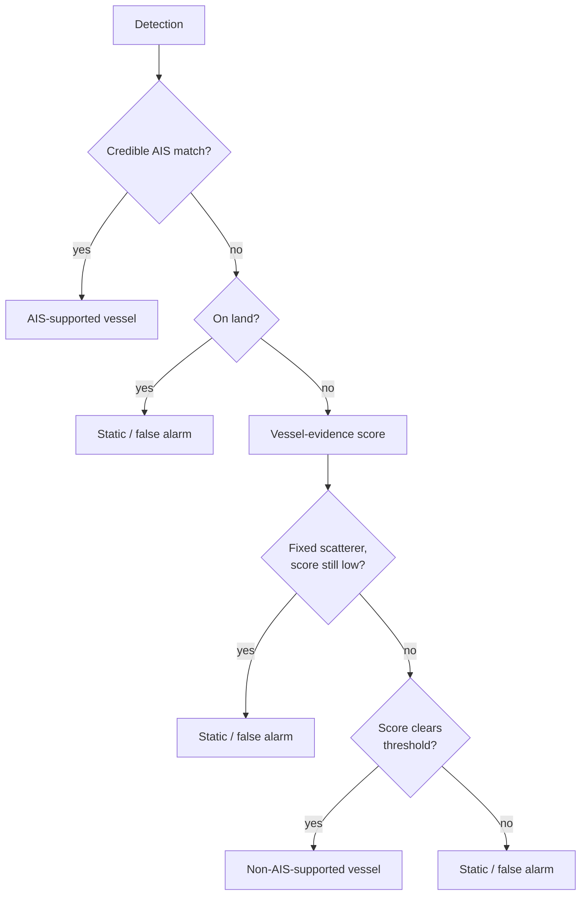

# SAR Ship Detection — 3-Class Classification

Ship detection and classification over the Singapore Strait from Sentinel-1 SAR
imagery. Every detected object is assigned to one of three classes — AIS-supported
vessel, non-AIS-supported vessel, or static/probable false alarm — with static objects
identified from their VV/VH backscatter behaviour across repeat satellite passes,
rather than from a single scene.

## 1. Data

- **Sentinel-1 IW GRD**, VV+VH, ascending, relative orbit 171, 18 scenes over the
  Singapore Strait AOI (15 development, 3 held out). Single-polarization pairs are
  calibrated to sigma-nought and geocoded from the SAFE product's ground-control-point
  grid.
- **SSDD** (SAR Ship Detection Dataset) [1] for detector training.
- **GSHHG** shoreline polygons [2] for land/coast context.
- **Global Fishing Watch** AIS vessel-presence data [3] for AIS association, matched by
  interpolating or taking the nearest hourly presence record relative to each scene's
  acquisition time.

## 2. Method

**Detection.** Two YOLO11s detectors are trained on SSDD: E0 (baseline) and E1
(trained with additional sensor-mix augmentation). Both run over every scene by tiled
inference; detections are fused across the two models by one-to-one spatial matching,
with agreement between them treated as consensus evidence rather than as independent
ground truth.

**Feature extraction.** For every fused detection, the pipeline segments the locally
bright connected component, estimates apparent length, width, orientation, and area
using local ground spacing from the scene's geolocation tie points, and measures VV/VH
target-to-background contrast in the calibrated raster.

**AIS association.** Detections are matched to Global Fishing Watch AIS presence
records by position and time; match quality is graded (`HIGH` / `MODERATE` / `LOW`)
based on temporal proximity and interpolation confidence. Only `HIGH`/`MODERATE`
matches are treated as credible.

**Static-object identification.** For every detection's location, VV/VH backscatter is
sampled across *every* scene date the satellite passed over — not only the dates a
detection fired there — producing a per-location time series of brightness relative to
local background. An object is treated as a fixed scatterer when it is bright on
≥82% of dates it could be checked, its position across repeat detections drifts by
≤20m, its contrast is stable over time (relative MAD ≤0.30), and it has been
observed on ≥4 separate dates — chosen so that a real vessel which happens to
recur at the same berth or anchorage, but is not present every time it is checked, is
not misclassified as static.

**Final decision.** A logistic-regression vessel-evidence model is trained using
credible AIS matches as positive examples and a conservative set of negative anchors
(on-land detections, and detections independently confirmed as fixed scatterers with
implausible geometry). The model consumes VV/VH contrast, the VV-VH gap, temporal
spike magnitude, bright-date persistence, detection persistence, position stability,
apparent geometry, detector confidence, water fraction, and distance to land. Its
decision threshold is calibrated by cross-validation to achieve 95% recall on held-out
AIS-confirmed vessels, converging to 0.40 on the 2026-08-31 run. The full decision
sequence:

Objects whose score falls within 0.08 of the decision threshold, or whose
classification depended on a borderline rule, are flagged for manual review; the flag
does not alter the assigned class.

## 3. Results

Development scenes, 11,914 objects, run 2026-08-31:

| Class | Count | % |
|---|---|---|
| Non-AIS-supported vessel | 5,923 | 49.7 |
| AIS-supported vessel | 3,481 | 29.2 |
| Static / probable false alarm | 2,510 | 21.1 |

Cross-validated against known AIS vessels: 95.0% recall, 94.0% balanced accuracy.
5% of objects were flagged for manual review under the criteria above.

`results/FINAL_3CLASS_OBJECTS.csv` is the full output: one row per object, with
`final_class_3`, the evidence behind it (position, geometry, VV/VH contrast, temporal
persistence and spike, `vessel_score`), a `classification_reason` string, and the
`review_flag`.

## 4. Repository organization

`01_model_training/` trains the two detectors in Colab. `02_detection_pipeline/` runs
detection, feature extraction, and AIS matching on Kaggle, producing an object table
with a first-pass 5-class label. `03_final_classification/` re-derives the final three
classes from that table using the VV/VH time-series method above — as a Kaggle
notebook, or locally via `scripts/run_vv_vh_3class_local.py` (`pip install -r
scripts/requirements.txt`) against a cached VV/VH scene array, with `SAR_PROJECT_ROOT`
set to your working directory. `models/` holds the frozen detector weights; `results/`
holds the output above.

## References

[1] T. Zhang et al., "SAR Ship Detection Dataset (SSDD): Official Release and
Comprehensive Data Analysis," *Remote Sensing*, 13(18):3690, 2021.
[github.com/TianwenZhang0825/Official-SSDD](https://github.com/TianwenZhang0825/Official-SSDD)

[2] P. Wessel and W. H. F. Smith, "A Global, Self-consistent, Hierarchical,
High-resolution Shoreline Database," *Journal of Geophysical Research*, 101(B4):
8741–8743, 1996.

[3] D. A. Kroodsma et al., "Tracking the Global Footprint of Fisheries," *Science*,
359(6378):904–908, 2018. Data via [globalfishingwatch.org](https://globalfishingwatch.org).

[4] Copernicus Sentinel-1 mission, European Space Agency.
